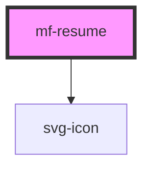

# my-component

<!-- Auto Generated Below -->

## Properties

| Property           | Attribute            | Description | Type      | Default |
| ------------------ | -------------------- | ----------- | --------- | ------- |
| `showDownloadLink` | `show-download-link` |             | `boolean` | `false` |

## Dependencies

### Depends on

- [svg-icon](../icon)

### Graph

----------------------------------------------

*Built with [StencilJS](https://stenciljs.com/)*
